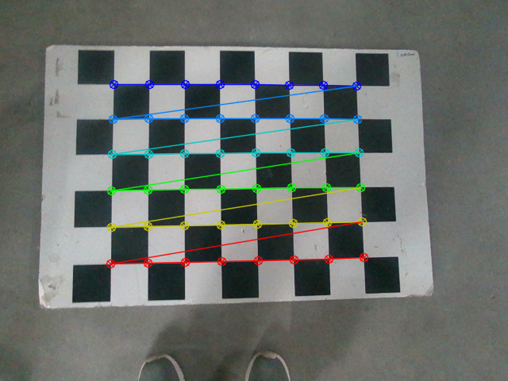
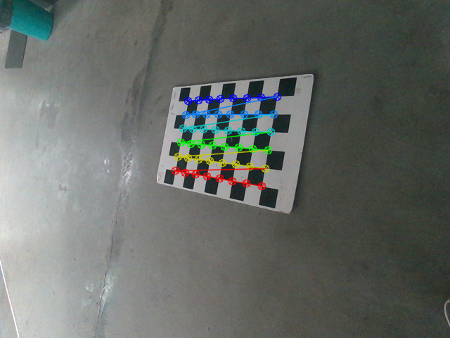
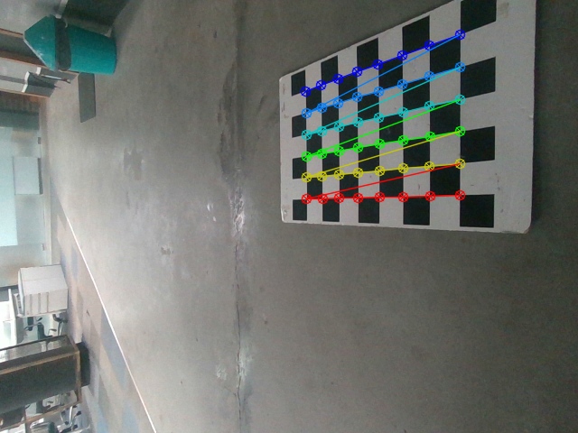

# Camera-IMU calibration

Team: The Ro-Bots \
Course: Mobile Robotics (CS7.503)\
Team Members: \
    1. Shreya Bollimuntha (2021112014) \
    2. Md Faizal Karim (2022121004)

## Important Commands

1. To start the intel realsense camera: \
```$ ros2 launch realsense2_camera rs_launch.py enable_gyro:=true enable_accel:=true unite_imu_method:=2-linear-interpolation rgb_camera.profile:=640x480x30 ```

2. To start capturing image as well as IMU data. **(Press 'q' to save the image and imu data at that time step)**:\
```$ ros2 run camera imu_node```

3. To listen to the camera topic: \
```$ ros2 topic echo /camera/color/image_raw```

4. To listen to the IMU data:
    - For accelerometer:\
    ```$ ros2 topic echo /camera/accel/sample```
    - For gyroscope:\
    ```$ ros2 topic echo /camera/gyro/sample```

5. To get information about camera:\
```$ ros2 topic echo /camera/color/camera_info```

6. Run calibration: \
```$ python3 calibrate.py```

## Roll, Pitch from Linear Acceleration

$Roll (\theta) = -\frac{180}{\pi} \times \arctan(\frac{x}{\sqrt{y^2 + z ^ 2}})$\
$Pitch (\phi) = -\frac{180}{\pi} \times \arctan(\frac{y}{\sqrt{x^2 + z ^ 2}})$

_Note: Yaw cannot be accurately calculated solely from linear acceleration because linear acceleration measures changes in velocity, not changes in orientation. Yaw is related to changes in orientation or rotation, and linear acceleration alone does not provide sufficient information about rotational motion. For this project, we are assuming the yaw ti be set to 0 and will remain constant throughout._

## Some Results
The following are results on images we took using intel realsense2 and also save the imu data corresponding to that image.

### Camera Matrix:
Predicted:
| 381.65496205 | 0           | 327.65836524 |
| ------------ | ------------ | ------------ |
| 0            | 382.26760471 | 243.63387831 |
| 0            | 0            | 1            |

True:

| 378.46        | 0           | 322.57034302 |
| ------------ | ------------ | ------------ |
| 0            | 378.04714966 | 242.00010681 |
| 0            | 0            | 1            |

$\fbox{MSE: 6.286}$

### Pose 1:



Rotation Matrix (Camera wrt World using camera calibration):
|  0.99775495  |  0.01802979  | -0.06449802 |
| ------------ | ------------ | ------------ |
| -0.01398245  |  0.99793689  |  0.06266144 |
|  0.06549472  | -0.06161892  |  0.99594857 |

Rotation Matrix (IMU wrt World from IMU Data):
|  0.99687847  | -0.02551567  | -0.07471458 |
| ------------ | ------------ | ------------ |
|  0.02558718  |  0.99967259  |  0.00000000 |
|  0.07469012  | -0.00191174  |  0.99720496 |

Rotation Matrix (IMU wrt Camera):
|  0.99917446  |  0.03890558  |  0.01169416 |
| ------------ | ------------ | ------------ |
| -0.03956146  |  0.99726792  |  0.06238264 |
| -0.00923518  | -0.06279378  |  0.99798379 |

$\fbox{MSE: 0.0012386287257617398}$

True Angles: [1.466, 355.715, 0]\
Predicted Angles: [358.964, 356.301, 356.399]

### Pose 2:


Rotation Matrix (Camera wrt World using camera calibration):
|  0.79450932  | -0.16961833  |  0.58308196 |
| ------------ | ------------ | ------------ |
|  0.12339663  |  0.98526029  |  0.11847122 |
| -0.59458239  | -0.02217614  |  0.80372881 |

Rotation Matrix (IMU wrt World from IMU Data):
|  0.80981051  | -0.09410628  |  0.57909494 |
| ------------ | ------------ | ------------ |
|  0.11543099  |  0.9933155   |  0.00000000 |
| -0.57522398  |  0.0668455   |  0.81526011 |

Rotation Matrix (IMU wrt Camera):
|  0.99966384  | -0.01087289  |  0.02353706 |
| ------------ | ------------ | ------------ |
|  0.00805831  |  0.9931541   |  0.11653328 |
| -0.02464298  | -0.11630444  |  0.99290785 |

$\fbox{MSE: 0.0031720480138413007}$

True angles: [6.628, 35.386, 0]\
Predicted angles: [12.051, 35.667, 351.614]

### Pose 3: 


Rotation Matrix (Camera wrt World using camera calibration):
|  0.66711449  |  0.01531334  |  0.74479779 |
| ------------ | ------------ | ------------ |
|  0.02563695  |  0.99872456  | -0.04349717 |
| -0.74451394  |  0.04811194  |  0.66587104 |

Rotation Matrix (IMU wrt World from IMU Data):
|  0.63895699  |  0.0289604   |  0.76869712 |
| ------------ | ------------ | ------------ |
| -0.04527801  |  0.99897442  |  0.00000000 |
| -0.76790876  | -0.03480508  |  0.63961296 |

Rotation Matrix (IMU wrt Camera):
|  0.99681545  | -0.07238127  | -0.03346498 |
| ------------ | ------------ | ------------ |
|  0.07084343  |  0.99646923  | -0.0450586  |
|  0.03660823  |  0.04254434  |  0.99842367 |

$\fbox{MSE: 0.0018425887185880483}$


True angles: [357.404, 50.237, 0]\
Predicted angles: [358.685, 48.141, 3.737]

## References
1. [Intel Realsense Github ](https://github.com/IntelRealSense/librealsense)
2. [Intel Realsense ROS Wrapper](https://github.com/IntelRealSense/realsense-ros)
3. [Computer Vision from First Principles](https://fpcv.cs.columbia.edu/)
4. [Roll, Pitch from Accelerometer](https://mwrona.com/posts/accel-roll-pitch/)